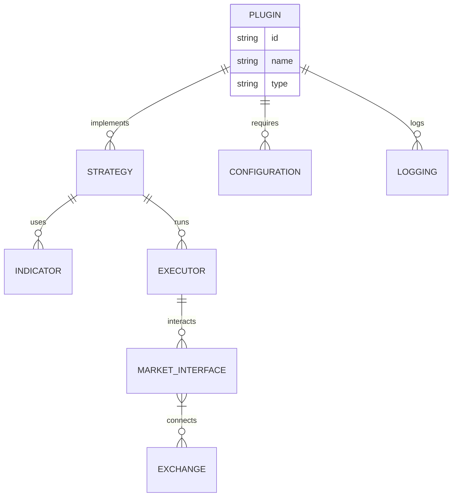

<br />


<br />
<br />

[](https://x.com/openbb_finance)
[](https://discord.com/invite/xPHTuHCmuV)
[](https://vscode.dev/redirect?url=vscode://ms-vscode-remote.remote-containers/cloneInVolume?url=https://github.com/OpenBB-finance/OpenBB)
<a href="https://codespaces.new/OpenBB-finance/OpenBB">
  
</a>
<a target="_blank" href="https://colab.research.google.com/github/OpenBB-finance/OpenBB/blob/develop/examples/googleColab.ipynb">
  
</a>
[](https://pypi.org/project/openbb/)


## Why Openbb Plugins?
Openbb Plugins let you **build once, use anywhere** across backtests, paper trading, and live markets.The OpenBB Platform offers access to equity, options, crypto, forex, macro economy, fixed income, and more while also offering a broad range of extensions to enhance the user experience according to their needs.

<a>
  <div align="center">
  
  </div>
</a>


They are:
- 🔌 Modular & reusable components
- 📦 Environment-agnostic (backtest, sandbox, live)
- 🧩 Easy to plug into any strategy or workflow
- 🌐 Exchange-agnostic with unified interfaces

Create, share, or combine plugins for indicators, strategies, risk controls, and more — all while keeping your code clean and scalable.


## OpenBB Workspace

While the OpenBB Platform is all about an integration to dozens of different data vendors, the interface is either Python or a CLI.

If you want an enterprise UI to visualize this datasets and use AI agents on top, you can find OpenBB Workspace at.


```python
import Openbb
"""
This example shows how backtest over tweets
"""

class TwitterBot(Openbb.Model):
    def main(self, args):
        while self.has_data:
            self.backtester.value_account()
            self.sleep('1h')

    def event(self, type_: str, data: str):
        # Now check if it's a tweet about Tesla
        if 'tsla' in data.lower() or 'gme' in data.lower():
            # Buy, sell or evaluate your portfolio
            pass


if __name__ == "__main__":
    exchange = Openbb.Alpaca()
    model = TwitterBot(exchange)

    # Add the tweets json here
    model.backtester.add_custom_events(Openbb.data.JsonEventReader('./tweets.json'))
    # Now add some underlying prices at 1 month
    model.backtester.add_prices('TSLA', '1h', start_date='3/20/22', stop_date='4/15/22')

    # Backtest or run live
    print(model.backtest(args=None, initial_values={'USD': 10000}))

```

## 🛠️ Installation

Follow the steps below to install and run this project on your local machine.

The OpenBB Platform can be installed as a [PyPI package](https://pypi.org/project/openbb/) by running `pip install openbb`

or by cloning the repository directly with `git clone https://github.com/OpenBB-finance/OpenBB.git`.

Please find more about the installation process, in the [OpenBB Documentation](https://docs.openbb.co/platform/installation).

### OpenBB Platform CLI installation

The OpenBB Platform CLI is a command-line interface that allows you to access the OpenBB Platform directly from your command line.

It can be installed by running `pip install openbb-cli`

or by cloning the repository directly with  `git clone https://github.com/OpenBB-finance/OpenBB.git`.

Please find more about the installation process in the

### 7. 🐳 Optional: Run with Docker

Build and run the plugin using Docker:

```bash
docker build -t Openbb-rsi-plugin .
docker run -it --env-file .env Openbb-rsi-plugin
```




<p align="center">
    
</p>

<p align="center">
  </center>
</p>

## Contributors

 wouldn't be  without you. If we are going to disrupt financial industry, every contribution counts. Thank you for being part of this journey.

<a href="https://github.com/OpenBB-finance/OpenBB/graphs/contributors">
   
</a>


## Installation

```bash
pip install package-name
```


## Usage

```python
import package_name

# Example usage
print("Hello World")
```


## Contributing

Contributions are welcome! Please feel free to submit a Pull Request.
